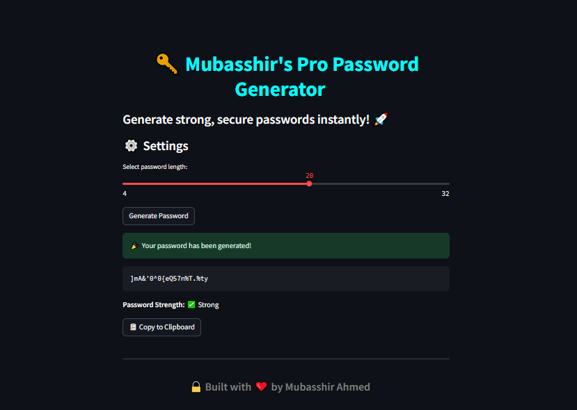

# 🔐 CyberShield - Password Generator

A modern **password generator app** built with **Python & Streamlit** that helps you create **strong, secure, and random passwords** in seconds.  
This project is part of my **AI & FSDS Progress Journal Series** 🚀



---

## 🌟 Features
- 🔑 **Generate strong & secure passwords** instantly
- ⚙️ Adjustable **password length** (4–32)
- ✅ Password **strength checker** (Weak / Medium / Strong)
- 📋 **Copy-to-clipboard** functionality
- 🖤 Clean **dark-mode UI**
- 💎 Personal branding: *"Built with ❤️ by Mubasshir Ahmed"*

---

## 🛠️ Tech Stack
- **Python 3**
- [Streamlit](https://streamlit.io/) – for interactive UI
- [Pyperclip](https://pypi.org/project/pyperclip/) – for clipboard functionality
- **Random & String libraries** – for password generation

---

## 📂 Project Structure
```
CyberShield-Password-Generator/
│── app.py              # Main Streamlit application
│── requirements.txt    # Python dependencies
│── assets/
│   └── ss.png          # App screenshot
│── README.md           # Project documentation
```

---

## ⚡ Installation & Usage

1️⃣ Clone the repository  
```bash
git clone https://github.com/mubasshirahmed-3712/CyberShield-Password-Generator.git
cd CyberShield-Password-Generator
```

2️⃣ Install dependencies  
```bash
pip install -r requirements.txt
```

3️⃣ Run the app  
```bash
streamlit run app.py
```

---

## 📸 UI Preview


---

## 🚀 Future Enhancements
- 🌐 Deploy on **Streamlit Cloud**
- 📱 Add **mobile-friendly view**
- 🔒 Option to save password history securely
- 🛡️ Integration with **password breach check APIs**

---

## ✨ Author & Branding
Built with ❤️ by **Mubasshir Ahmed**  

🔗 [GitHub Journal](https://github.com/mubasshirahmed-3712/AI-FSDS-progress-journal)  
🔗 [LinkedIn](https://www.linkedin.com/in/mubasshir3712)

---
